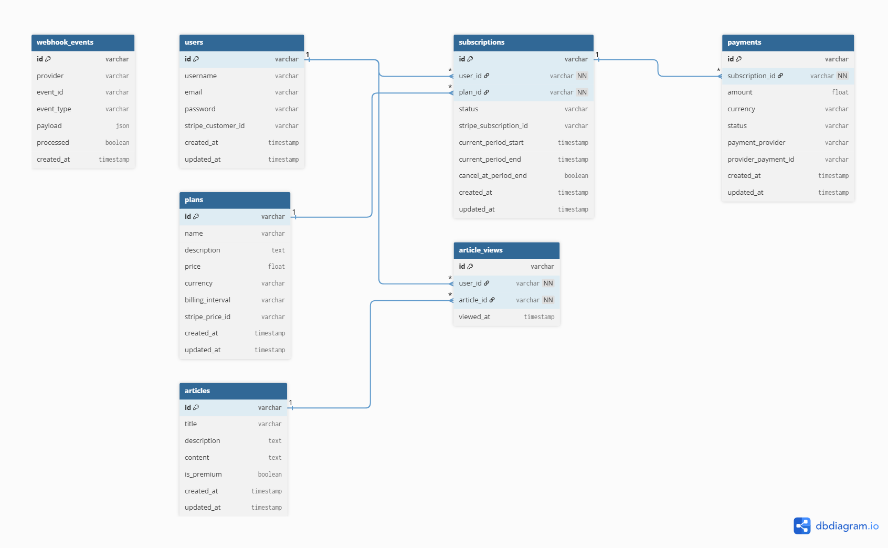

# Sistema de Assinaturas para Plataforma de Artigos

Este projeto é uma API construída com **NestJS** para gerenciar um sistema completo de assinaturas digitais, utilizando como caso de uso uma plataforma de leitura de artigos com conteúdo gratuito e premium.

A aplicação foi projetada para oferecer uma base robusta e escalável para negócios baseados em assinatura, permitindo autenticação de usuários, gerenciamento de planos, pagamentos recorrentes e controle de acesso a conteúdos exclusivos.

---

## Principais funcionalidades

- **Autenticação com JWT**  
  Sistema seguro de autenticação e autorização utilizando JSON Web Tokens para cadastro, login e proteção de rotas privadas.

- **Sistema de assinaturas com Stripe**  
  Integração com o Stripe para:
  - Criação de clientes
  - Checkout de assinaturas
  - Gerenciamento de planos
  - Pagamentos recorrentes
  - Cancelamento e renovação de assinaturas
  - Processamento de webhooks

- **Redis para performance e escalabilidade**  
  Utilizado para:
  - Cache de dados estratégicos
  - Rate limiting
  - Controle de sessões
  - Processamento otimizado de fluxos temporários

- **Envio de emails com Resend + React Email**  
  Sistema de comunicação transacional para:
  - Boas-vindas
  - Confirmação de assinatura
  - Alertas de pagamento
  - Notificações de cancelamento

- **Controle de acesso a artigos premium**  
  Usuários gratuitos podem acessar conteúdos públicos, enquanto assinantes possuem acesso liberado a artigos exclusivos.

---

## Tecnologias principais

- **NestJS**
- **PostgreSQL**
- **Prisma ORM**
- **JWT Authentication**
- **Stripe API**
- **Redis**
- **Resend**
- **React Email**

---

## Caso de uso do projeto

A proposta deste sistema é simular uma plataforma moderna de conteúdo por assinatura, semelhante a portais de notícias, blogs premium ou hubs educacionais, onde:

- Usuários criam contas
- Escolhem planos de assinatura
- Realizam pagamentos recorrentes
- Recebem emails automatizados
- Acessam conteúdos premium conforme sua assinatura

---

## Arquitetura de dados

A estrutura do banco foi planejada para suportar autenticação, assinaturas, pagamentos, consumo de conteúdo e processamento seguro de eventos externos (como webhooks do Stripe).

### Esquema do Banco de Dados

